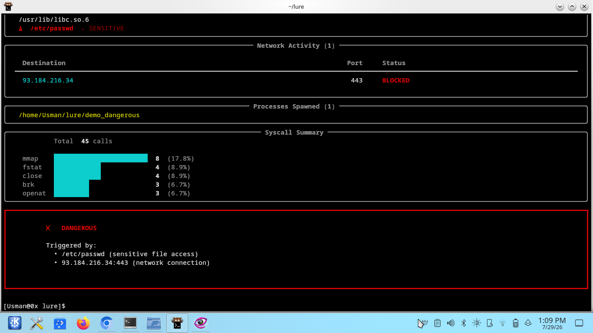
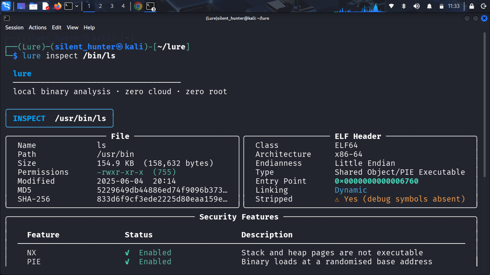
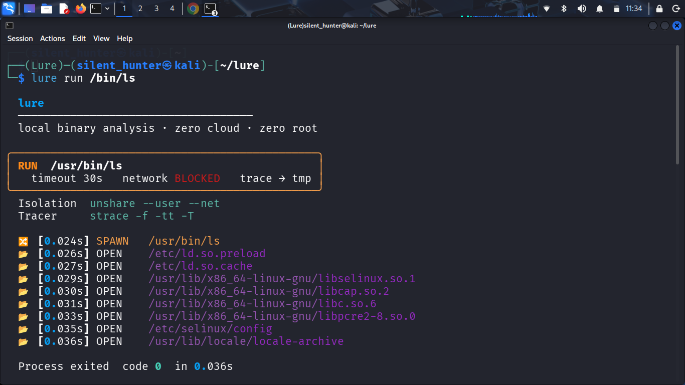
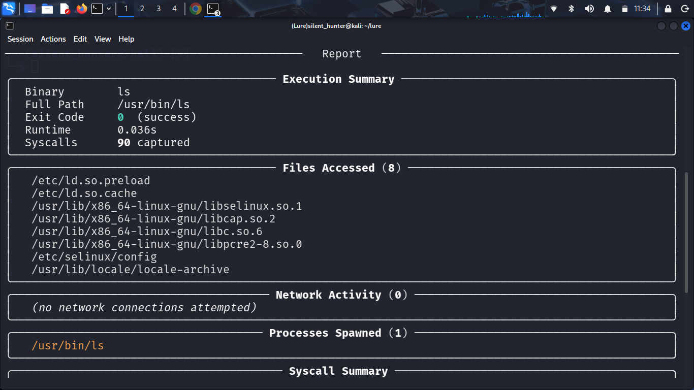
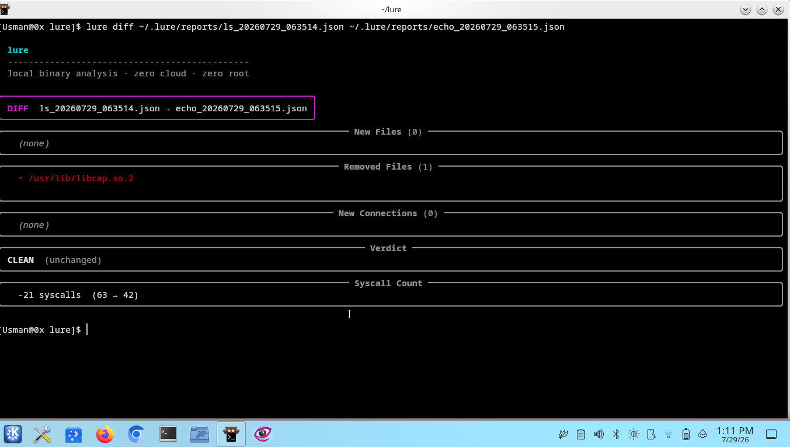

# lure

> Local Linux binary analysis. Zero cloud. Zero root. Zero cost.


⚠️ **Early development (v0.3.0).** Core features (`inspect`, `run`,
`diff`) work end to end on x86_64 Linux. This is a young project —
expect rough edges, limited error handling on unusual inputs, and
missing features. Bug reports, feedback, and contributions are very
welcome. Network isolation is enforced. Filesystem isolation is
not — run inside a VM when analyzing untrusted samples.



## What it does

Lure runs an untrusted Linux binary in a lightweight monitoring
environment (user + network namespaces + strace) and tells you
exactly what it did — which files it touched, what network
connections it tried, what processes it spawned — then gives you a
plain verdict: **CLEAN**, **SUSPICIOUS**, or **DANGEROUS**.

Everything happens on your machine. Nothing is uploaded anywhere.

## Why

- **Privacy** — sensitive or client samples never leave your machine
- **Zero setup** — no VM, no Docker, no Cuckoo install process
- **Readable** — structured reports instead of raw strace noise
- **Free** — MIT licensed, runs on tools already on Kali Linux

## Isolation model

Lure uses Linux user and network namespaces to prevent the binary
from making outbound network connections. The host filesystem
remains visible to the analyzed binary. For stronger isolation
(mount namespace, seccomp, cgroups), run Lure inside a VM or
container. Lure is primarily a behavioral observation tool, not a
hardened sandbox.

## Install

### From PyPI (recommended)

```bash
pip install lure-analyze --break-system-packages
lure --version
```

### From source

```bash
git clone https://github.com/0xusmanismail/lure.git
cd lure
pip install -e . --break-system-packages
```

Note: the PyPI package is named `lure-analyze` because "lure" was
already taken. The command is still `lure`.

The `--break-system-packages` flag is required on Arch Linux and on
recent Debian/Ubuntu releases, which restrict installing into the
system Python environment by default (PEP 668).

Requires `strace` and `unshare` installed.

## Tested on

- Arch Linux (primary development platform)
- Kali Linux
- Debian / Ubuntu

## Usage

### Inspect a binary

```bash
lure inspect /bin/ls
```

Reads ELF headers, architecture, security mitigations, linked libraries, and file hashes — without executing a single byte of code.



### Run a binary in the sandbox

```bash
lure run ./suspicious_binary
```

Live feed of file access, network attempts, and spawned processes, followed by a full behavioral report.





### Catch suspicious behavior

```bash
lure run ./demo_dangerous
```

Sensitive file access combined with network activity trips a DANGEROUS verdict, with the exact triggers listed.


### Compare two runs with lure diff

```bash
lure run --save /bin/ls
lure run --save /bin/echo
lure diff report1.json report2.json
```

Shows new/removed files, new connections, verdict changes, and syscall count differences between two saved runs.



### Save a report

```bash
lure run --save ./binary
```

Saves the full report to `~/.lure/reports/` as both a plain-text `.txt` file and a structured `.json` file.

## Status & Roadmap

**Working now:**
- ELF inspection with security mitigation detection
- UPX packer detection in inspect
- Sandboxed execution via `unshare` + `strace`
- Live event feed during execution
- Full behavioral report with CLEAN/SUSPICIOUS/DANGEROUS verdict
- Verdict shows exact triggering files and IPs
- Report saving (plain text + JSON)
- Report comparison via `lure diff`
- Non-ELF file detection with clean error messages
- Works on Arch Linux, Kali, Debian, Ubuntu
- Available on PyPI as lure-analyze
- Demo GIF in README

**Planned:**
- Automated test suite
- Mount namespace (stronger filesystem isolation)
- seccomp syscall filtering
- ARM64 binary support
- Windows PE analysis (via Wine)

## License

MIT — see [LICENSE](LICENSE)
