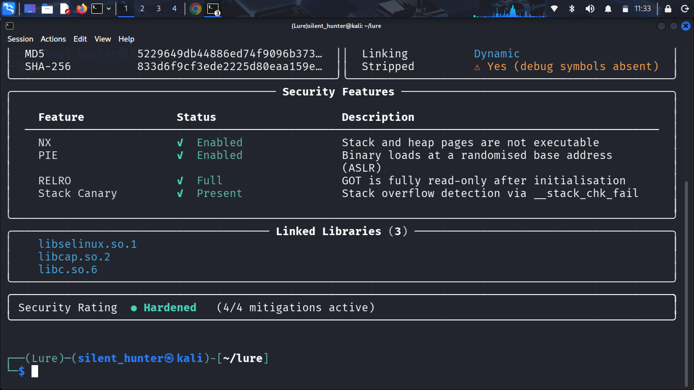
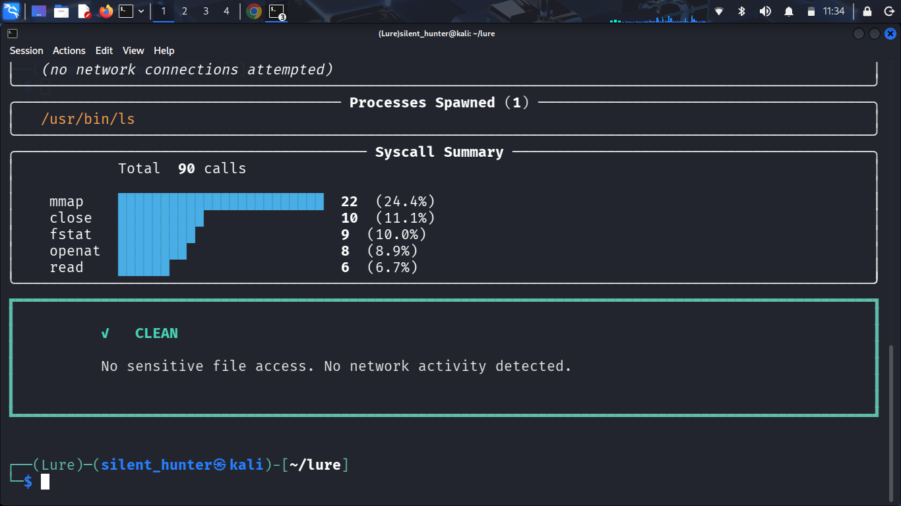

# lure

> Local Linux binary analysis. Zero cloud. Zero root. Zero cost.

⚠️ **Early development (v0.2).** Core features (`inspect`, `run`,
`diff`) work end to end on x86_64 Linux. This is a young project —
expect rough edges, limited error handling on unusual inputs, and
missing features. Bug reports, feedback, and contributions are very
welcome.


## What it does

Lure runs an untrusted Linux binary inside an isolated sandbox
(Linux namespaces + strace) and tells you exactly what it did —
which files it touched, what network connections it tried, what
processes it spawned — then gives you a plain verdict:
**CLEAN**, **SUSPICIOUS**, or **DANGEROUS**.

Everything happens on your machine. Nothing is uploaded anywhere.

## Why

- **Privacy** — sensitive or client samples never leave your machine
- **Zero setup** — no VM, no Docker, no Cuckoo install process
- **Readable** — structured reports instead of raw strace noise
- **Free** — MIT licensed, runs on tools already on Kali Linux

## Install

```bash
git clone https://github.com/0xusmanismail/lure.git
cd lure
pip install -e . --break-system-packages
```

The `--break-system-packages` flag is required on Arch Linux and on
recent Debian/Ubuntu releases, which restrict installing into the
system Python environment by default (PEP 668). You can alternatively
run `./setup.sh` to install (and reinstall) everything automatically.

Requires `strace` and `unshare`. On Arch: `sudo pacman -S strace`
(`unshare` is part of `util-linux`, installed by default). On
Debian/Ubuntu/Kali: `sudo apt install strace`. On Fedora:
`sudo dnf install strace`.

## Usage

### Inspect a binary

```bash
lure inspect /bin/ls
```

Reads ELF headers, architecture, security mitigations (NX, PIE,
RELRO, stack canary), linked libraries, file hashes, and packer
detection — without executing a single byte of code.




### Run a binary in the sandbox

```bash
lure run /bin/ls
```

Live feed of file access, network attempts, and spawned processes
during execution, followed by a full report: execution summary,
files accessed, network activity, process tree, syscall breakdown,
and a CLEAN / SUSPICIOUS / DANGEROUS verdict.




### Save the report

```bash
lure run --save /bin/ls
```

Saves the full report to `~/.lure/reports/` as both a plain-text
`.txt` file and a structured `.json` file.

### Compare two reports

```bash
lure diff ~/.lure/reports/a.json ~/.lure/reports/b.json
```

Shows new/removed files, new network connections, verdict changes,
and the syscall count delta between two saved runs.

## Status & Roadmap

This is a v0.2 release built and tested on Arch Linux (x86_64).

**Working now:**
- ELF inspection with security mitigation detection
- Sandboxed execution via `unshare` + `strace`
- Live event feed during execution
- Full behavioral report with verdict, listing exact triggers
- Report saving (`.txt` + `.json`)
- Report comparison (`lure diff`)

**Planned:**
- Better edge-case handling (invalid binaries, missing args, etc.)
- Refined verdict heuristics
- Packaged releases (no manual `pip install -e .`)

Issues and pull requests are welcome — this project is actively
developed.

## License

MIT — see [LICENSE](LICENSE)
